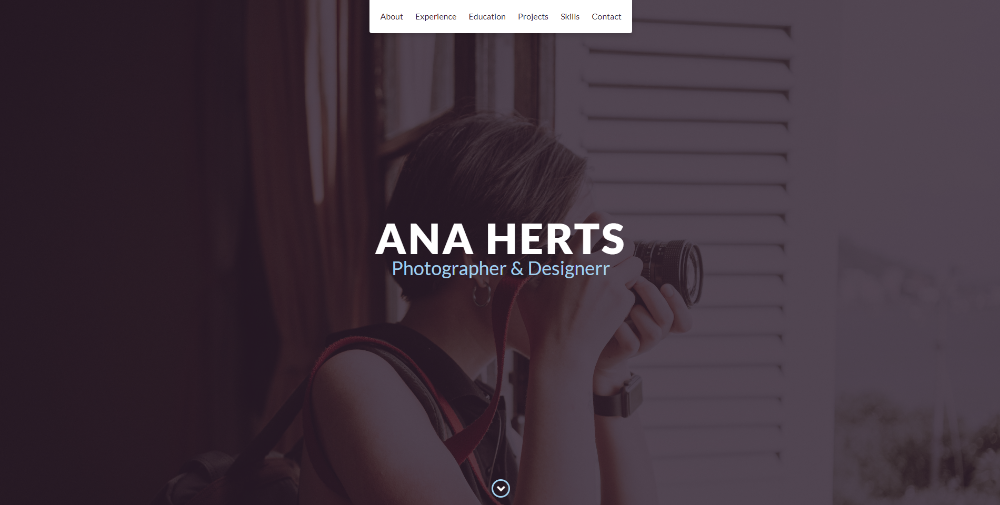
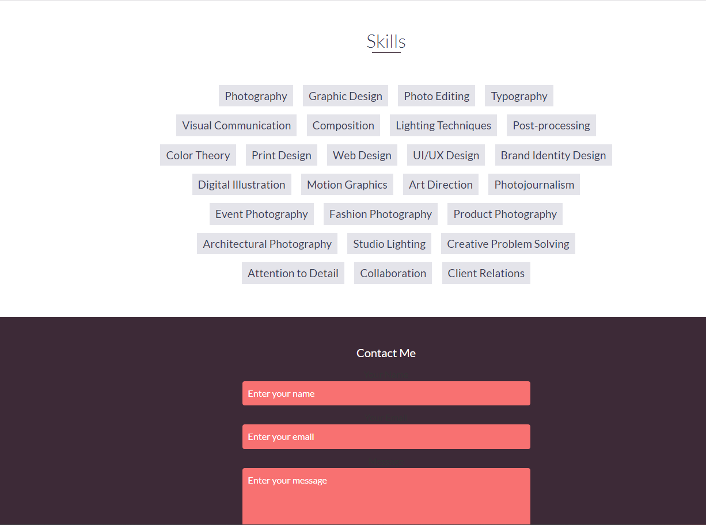
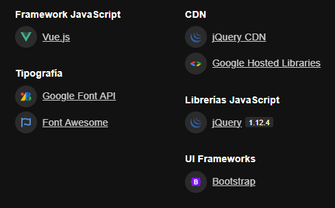

<h1 align="center">Proyecto de Desarrollo Web</h1>

  
  

Este proyecto es una aplicación web que se utiliza para mostrar información sobre tecnologías utilizadas en el desarrollo.

## Características

- Muestra una imagen descriptiva de las tecnologías utilizadas.
- Muestra una lista de colores utilizados en el desarrollo.
- Incluye un botón en el footer que abre un modal.

## Tecnologías utilizadas

## Instalación

1. Clona este repositorio: `git clone https://github.com/guidohalley/parcial-taller.git`
2. Navega al directorio del proyecto: `cd parcial-taller`
3. Abre el archivo `index.html` en tu navegador.

## Contribución

Si deseas contribuir a este proyecto, sigue estos pasos:

1. Haz un fork de este repositorio.
2. Crea una rama para tu contribución: `git checkout -b mi-contribucion`
3. Realiza tus cambios y realiza un commit: `git commit -m "Mi contribución"`
4. Haz push a tu rama: `git push origin mi-contribucion`
5. Abre una pull request en este repositorio.

## Créditos

- Desarrollado por [Guido Halley ](https://github.com/guidohalley)

